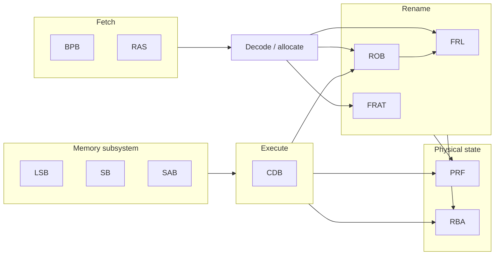

# Tomasulo3CPU — implementation plan (target modules)

Roadmap for an **out-of-order CPU** using **physical register renaming**, a **ROB**, **Tomasulo-style scheduling**, and the named blocks below. Build **bottom-up**: rename/commit correctness first, then execute (**CDB**), then memory (**LSB** / **SB** / **SAB**), then fetch polish (**BPB** / **RAS**).

## Target modules (your list)

| Acronym | Name | Role |
|--------|------|------|
| **BPB** | Branch Prediction Buffer | Predicts branch direction/target so fetch can run ahead of resolved branches. |
| **RAS** | Return Address Stack | Predicts return targets for `ret`-style ops (pairs with call sites). |
| **FRL** | Free Register List | Stack/queue of **free physical register indices**; supplies new `rd` tags on rename; **reclaims** old mappings on ROB commit. |
| **FRAT** | Front-end Register Alias Table | Per **architectural** register: current **speculative** physical register tag. Read at rename; updated when instructions allocate `rd`; **restored** on flush/mispredict (from checkpoint or rollback scheme). |
| **ROB** | Reorder Buffer | In-order window: one entry per inflight op; tracks **done**, **exception**, **destination**; **commit** retires in program order and drives **deallocate** into **FRL** + architectural state update. |
| **SB** | Store Buffer | Holds **store data** (and usually associates with ROB id / age) until store can commit or write memory under your memory model. |
| **RBA** | Ready Bit Array | One **ready** bit per physical register: cleared on allocate, set when the producing value is known (**CDB** or non-speculative write path you define). Issue logic uses this (and/or bypass) to know operands are valid. |
| **PRF** | Physical Register File | Wide register file indexed by **physical** tag; holds speculative values; written by **CDB** (and possibly other legal writers). |
| **CDB** | Common Data Bus | Broadcasts `{phys_dst, value, valid, …}` from completed execution (and sometimes load completion); updates **PRF**, **RBA**, and wakeup dependents. |
| **SAB** | Store Address Buffer | Tracks **pending store addresses** (often with ROB order) for **load–store disambiguation** and forwarding decisions vs **LSB**/loads. |
| **LSB** | Load/Store Buffer | Unified structure for **in-flight loads and stores** (or the port where memory ops queue before **dmem**); works with **SB**/**SAB** so loads see the right younger/older stores. |

## Also required (not in the acronym list)

Tomasulo still needs execution and fetch plumbing; name them however you like:

- **Fetch**: PC, instruction memory (or cache interface), fetch queue.
- **Decode / rename dispatch**: splits opcode, arch regs, immediates; consumes **FRAT**/**FRL**/**ROB** slots.
- **Scheduler**: reservation stations or unified issue queues feeding functional units.
- **Functional units**: ALU, mul/div (optional), AGU (address generation), branch resolution.
- **Data memory interface**: `dmem` + alignment/misaligned policy.

---

## How the pieces fit (high level)

- **Rename**: **FRAT** maps arch → phys; **FRL** hands out a fresh phys tag for each writer; **ROB** records order so commit can retire safely and recycle registers.
- **Operands**: reads come from **PRF** using renamed sources; **RBA** tells you if each operand tag is already valid.
- **Complete**: **CDB** writes results into **PRF**, sets **RBA**, marks **ROB** entries complete, and wakes scheduler entries waiting on those tags.
- **Memory**: **LSB** orchestrates loads/stores; **SB**/**SAB** split data vs address tracking as you prefer for forwarding and ordering with **ROB** commit.

---

## Phased build plan (recommended order)

### Phase 0 — Contracts

Fix in a SystemVerilog `pkg` or header doc:

- ISA, widths: **phys reg index** width, **ROB index** width, **CDB** payload.
- **Commit rule**: one ROB head commits per cycle vs wider commit.
- **Flush model**: how **FRAT** is restored on branch mispredict (snapshot FRAT, or rollback using ROB — pick one and stay consistent).

### Phase 1 — **PRF** and **RBA**

- **PRF**: async/comb read, timed write; enough ports for rename read + issue read + CDB write.
- **RBA**: same indexing as PRF; set on produce, clear on allocate (when a new writer is renamed to that phys reg — your exact policy ties to **FRL**/ROB).

**Milestone:** Directed test: write tag *t* via fake CDB, read PRF, see RBA=1.

### Phase 2 — **FRL**

- Push free tags at reset; `allocate` pops; `free` pushes on commit-side recycle (driven later by **ROB**).
- Underflow/overflow checks in sim.

**Milestone:** Random allocate/free sequence matches reference model.

### Phase 3 — **ROB** (structure first)

- Circular buffer: allocate tail, commit head, mark **done**/`exception` fields.
- Connect **commit** to `free` of **old phys tag** (the one overwritten for that arch dest) — needs arch dest and **previous** tag stored per ROB entry or derivable from **FRAT** snapshot.

**Milestone:** In-order commit order verified with dummy entries (no real exec yet).

### Phase 4 — **FRAT** + rename smoke test

- On each allocating instruction: read arch src tags from **FRAT**, read **FRL** for new `rd` tag, write **FRAT[rd_arch]** = new tag.
- Stall when **ROB** or **FRL** full.

**Milestone:** Trace rename of a short sequence; flush clears speculative state per your chosen mechanism.

### Phase 5 — **CDB**

- One or more buses: arbiter picks among FU/load completions.
- **CDB** → write **PRF[dst]**, **RBA[dst]=1**, **ROB**.done.

**Milestone:** Synthetic “FU” feeds CDB; ROB marks complete in correct order relative to issue.

### Phase 6 — Scheduler + FUs (implementation-specific)

- Reservation stations / issue queues wait on **RBA** for operand tags; wakeup from **CDB** tag match.
- ALU/AGU produce **CDB** writes.

**Milestone:** OoO arithmetic with no loads/stores yet.

### Phase 7 — **LSB**, **SB**, **SAB**

- Define division of labor (example): **SAB** + **SB** hold pending store address/data by age; **LSB** tracks loads and interfaces to **dmem**; load compares against **SAB** for forwarding/blocked load rules.
- Store commits to memory when **ROB** commits the store (typical in-order commit to memory with your WAW/WAR rules).

**Milestone:** Load-after-store and aliasing tests pass.

### Phase 8 — **BPB** and **RAS**

- Start with static predict-not-taken if you want; then add **BPB** (PC-indexed table) and **RAS** (push on call, pop on return style).
- Mispredict: redirect fetch + **FRAT** restore + squash ROB tail + reclaim **FRL** per your rollback design.

**Milestone:** Loop and function-return microbenchmarks; verify flush correctness.

---

## Verification checklist

| Layer | What to assert |
|--------|----------------|
| **FRL** | No double-free; free count + allocated count = constant after reset burst. |
| **FRAT** | After flush, matches golden checkpoint for that redirect PC. |
| **ROB** | Commits match program order; phys recycle matches arch retire semantics. |
| **CDB** | Every broadcast tag corresponds to an inflight producer; single writer per phys tag lifetime. |
| **Memory** | Load never takes stale value vs younger committed stores per your rules. |

---

## Suggested `src/` naming (optional)

| File | Module |
|------|--------|
| `bpb.sv` | `BPB` |
| `ras.sv` | `RAS` |
| `frl.sv` | `FRL` |
| `frat.sv` | `FRAT` |
| `rob.sv` | `ROB` |
| `sb.sv` | `SB` |
| `rba.sv` | `RBA` |
| `prf.sv` | `PRF` |
| `cdb.sv` | `CDB` |
| `sab.sv` | `SAB` |
| `lsb.sv` | `LSB` |

---

**Summary:** Implement **PRF/RBA → FRL → ROB → FRAT**, then **CDB** and execution, then **LSB/SB/SAB**, then **BPB/RAS**. That order maximizes debuggability for a renaming CPU with your module set.
