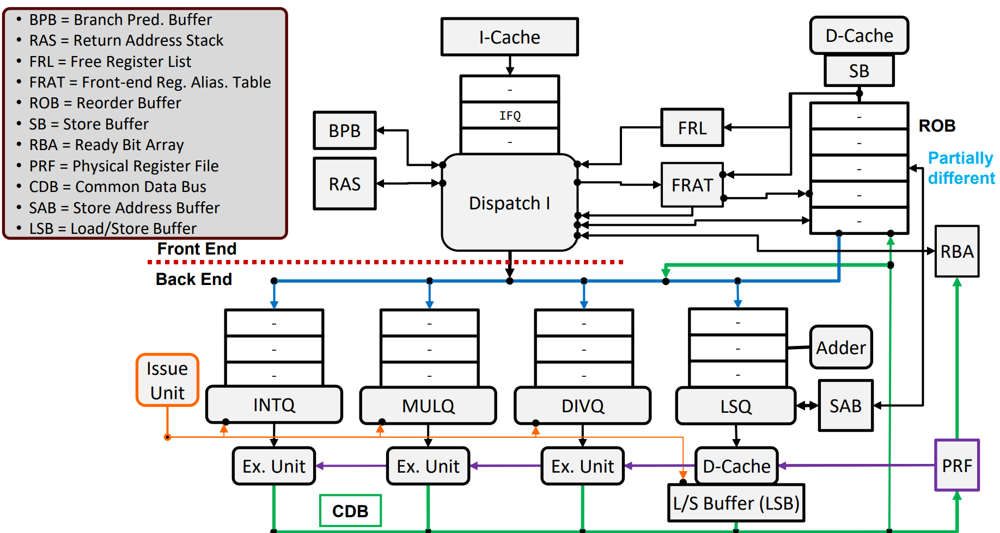

# Tomasulo3CPU

A 64-bit **out-of-order RISC-V CPU** using physical register renaming, a reorder buffer, and Tomasulo-style scheduling. Targets the RV64IM subset with branch prediction and speculative execution.

## Architecture Overview



The CPU is split into a **front-end** (fetch, decode, rename, dispatch, commit) and a **back-end** (issue, execute, writeback).

### Front-End (`CPU_FRONT_END`)

| Module | Role |
|--------|------|
| **IFQ** | Instruction Fetch Queue — fetches from I-Cache, buffers decoded instructions |
| **DISPATCH** | Decodes RISC-V instructions, renames registers, dispatches to issue queues |
| **BPB** | Branch Prediction Buffer — 2-bit saturating counter predictor |
| **RAS** | Return Address Stack — predicts JALR return targets |
| **FRL** | Free Register List — supplies physical register tags on rename |
| **FRAT** | Front-end Register Alias Table — speculative arch→phys mapping with checkpoints |
| **RRAT** | Retirement Register Alias Table — committed arch→phys mapping |
| **ROB** | Reorder Buffer — tracks in-flight instructions, commits in program order |
| **SB** | Store Buffer — holds committed stores for D-Cache write-out |
| **RBA** | Ready Bit Array — tracks which physical registers have valid data |

### Back-End (`CPU_BACK_END`)

| Module | Role |
|--------|------|
| **ISSUEQ** | Issue Queues — separate queues for INT, MUL, DIV, and LD/ST operations |
| **ISSUEUNIT** | Issue Unit — arbitrates which ready instructions enter execution |
| **PRF** | Physical Register File — 128-entry, multi-ported |
| **EXE** | Execution Units — ALU (1-cycle), MUL (4-cycle), DIV (7-cycle) |
| **LSB** | Load/Store Buffer — manages memory operations and D-Cache interface |
| **CDB** | Common Data Bus — broadcasts results, wakes dependents, handles flush |

### Top-Level (`CPU`)

Combines front-end and back-end with external I-Cache and D-Cache interfaces.

## Supported Instructions (current)

RV64IM-oriented subset verified with directed `CPU_tb` tests and the [riscv-tests](arch_test/) manifest (47 tests). See [doc/VERIFICATION_STATUS.md](doc/VERIFICATION_STATUS.md).

| Type | Instructions |
|------|-------------|
| **R-type ALU** | ADD, SUB, AND, OR, XOR, SLT, SLTU, SLL, SRL, SRA |
| **I-type ALU** | ADDI, ADDIW, ANDI, ORI, XORI, SLTI, SLTIU, SLLI, SRLI, SRAI |
| **M-extension** | MUL, DIV, REM |
| **Load/Store** | LD, LW, LWU, SD, SW, SB, SH, LB, LBU, LH, LHU |
| **Branch** | BEQ, BNE, BLT, BGE, BLTU, BGEU |
| **Jump** | JAL, JALR |
| **U-type** | LUI, AUIPC |
| **CSR / traps** | CSRRW/S/C, CSRRWI, ECALL, EBREAK, MRET (directed TB) |

## Directory Structure

```
Tomasulo3CPU/
├── src/
│   ├── CPU.sv                  # Top-level integration
│   ├── CPU_FRONT_END.sv        # Front-end pipeline
│   ├── back_end/
│   │   └── CPU_BACK_END.sv     # Back-end pipeline
│   ├── RISC_V_DECODER.sv       # Instruction decoder
│   ├── riscv_opcode_pkg.sv     # Opcode definitions
│   ├── riscv_funct_pkg.sv      # Funct3/Funct7 constants
│   ├── riscv_types_pkg.sv      # Enum types (instr_e, alu_op_e, etc.)
│   ├── BPB.sv, RAS.sv, FRL.sv, FRAT.sv, RRAT.sv
│   ├── ROB.sv, SB.sv, RBA.sv, IFQ.sv, DISPATCH.sv
│   ├── ISSUEQ.sv, ISSUEUNIT.sv, PRF.sv, EXE.sv
│   ├── LSB.sv, CDB.sv
│   └── ...
├── tb/
│   ├── CPU_tb.sv               # Full CPU integration testbench
│   ├── CPU_FRONT_END_tb.sv     # Front-end unit test
│   ├── CPU_BACK_END_tb.sv      # Back-end unit test
│   └── *_tb.sv                 # Per-module unit tests
└── image/
    └── design_overview.png
```

## Key Design Parameters

| Parameter | Default | Description |
|-----------|---------|-------------|
| `XLEN` / `REG_FILE_DATA_WIDTH` | 64 | Data path width (RV64) |
| `PHY_REGISTER_FILE_WIDTH` | 7 | 128 physical registers |
| `ROB_DEPTH` | 16 | Reorder buffer entries |
| `ISSUE_QUEUE_DEPTH` | 16 | Entries per issue queue |
| `FRL_SIZE` | 128 | Free list capacity |
| `NUM_CHECKPOINT` | 8 | FRAT checkpoint slots for branch recovery |
| `DIV_CYCLES` | 7 | Division latency |
| `MUL_CYCLES` | 4 | Multiplication latency |

## Key Microarchitectural Features

- **Register renaming** via FRAT + FRL eliminates WAW/WAR hazards
- **Checkpoint-based recovery** — FRAT snapshots restore on branch mispredict
- **Speculative execution** — fetches past predicted branches, flushes on mispredict
- **Out-of-order execution** — instructions issue when operands ready (CDB wakeup)
- **In-order commit** — ROB retires in program order for precise exceptions
- **Branch prediction** — 2-bit BPB + RAS for calls/returns
- **Store buffer** — decouples store commit from D-Cache write latency

## Verification summary

| Layer | Status |
|-------|--------|
| Module TBs (`tb/*_tb.sv`) | Per-block (Makefile) |
| Full CPU directed (`CPU_tb.sv`) | **55 / 55** |
| Official riscv-tests (`arch_test/`) | **47 / 47** |
| Bare-metal C (`bubble_sort`) | Pass |

## Documentation

- [Verification status](doc/VERIFICATION_STATUS.md) — methodology, results, known limitations, planned work

## RISC-V architecture tests (riscv-tests)

Official ISA tests from `third_party/riscv-tests` are built and run against the full CPU:

```bash
cd arch_test
python build_tests.py              # build manifest
# Recompile Questa model after RTL changes — see arch_test/README.md
python run_tests.py                # run all built tests
```

See [arch_test/README.md](arch_test/README.md) for toolchain setup, Questa compile, and manifests.

## Building / Simulation

The testbench supports both VCS/FSDB and open-source (Icarus/VCD) flows:

```bash
# Example with Icarus Verilog
iverilog -g2012 -o cpu_tb \
    src/riscv_opcode_pkg.sv src/riscv_funct_pkg.sv src/riscv_types_pkg.sv \
    src/*.sv src/back_end/*.sv tb/CPU_tb.sv
vvp cpu_tb

# Example with VCS
vcs -sverilog -full64 +v2k \
    src/riscv_opcode_pkg.sv src/riscv_funct_pkg.sv src/riscv_types_pkg.sv \
    src/*.sv src/back_end/*.sv tb/CPU_tb.sv \
    -o simv && ./simv
```
